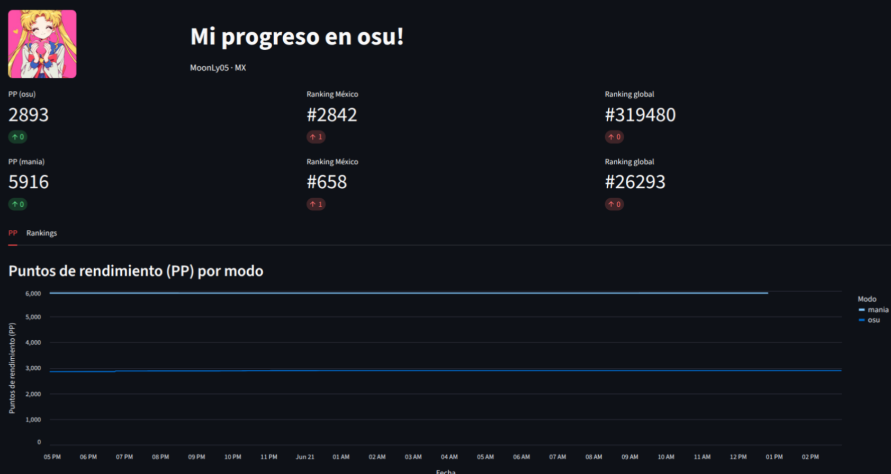

# Trackear perfil de Osu!

Proyecto enfocado al seguimiento del progreso de tu cuenta de Osu! usando su propia api que proporciona el juego.

## Tecnologías utilizadas


- **Python**: Lenguaje principal del proyecto.
- **Streamlit**: Creación del dashboard web e interfaz de usuario.
- **Pandas**: Procesamiento y manipulación de datos.
- **SQLite**: Almacenamiento local del histórico de datos.

## Conseguir datos

Es necesario hacer una copia al archivo .env.example y renombrarlo como .env y llenarlo con tus keys que te proporciona el juego en las configuraciones de tu cuenta.

(CLIENT_ID, CLIENT_SECRET, USERNAME)

https://osu.ppy.sh/

Posteriormente creamos nuestro entorno de desarrollo, en este caso usando el paquete/libreria "uv" que esta enfocada al lenguaje de programacion python, despues ejecutamos "recolector.py".

------NOTA-------

Cuando ejecutas "recolector.py" consigue los datos del momento y a futuro no recolecta datos viejos o pasados.
## Deployment

Pasos para ejecutar el proyecto

```bash
uv sync
```
```bash
uv run streamlit run dashboard.py
```

O tambien puedes construirlo desde docker compose

```bash
docker compose up -d --build
```

## Vista previa del dashboard


## Automatizar la recoleccion de datos (Crontab)
El recolector.py solo guarda los datos del momento en que se ejecuta, así que para construir un histórico hay que correrlo automáticamente cada cierto tiempo con cron. Primero asegúrate de tener cron instalado y activo (en Debian/Ubuntu suele venir; en Arch/CachyOS se instala con cronie). Luego edita tus tareas con crontab -e y agrega la línea de abajo, ajustando la ruta a donde tengas el proyecto.
```bash
*/30 * * * * cd /ruta/a/osu-tracker && /ruta/a/osu-tracker/.venv/bin/python recolector.py >> cron.log 2>&1
```
